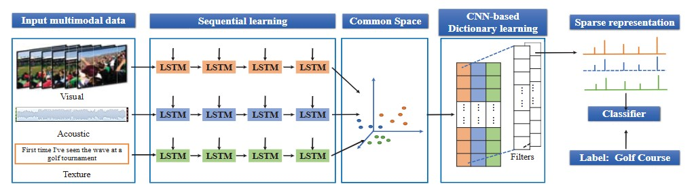
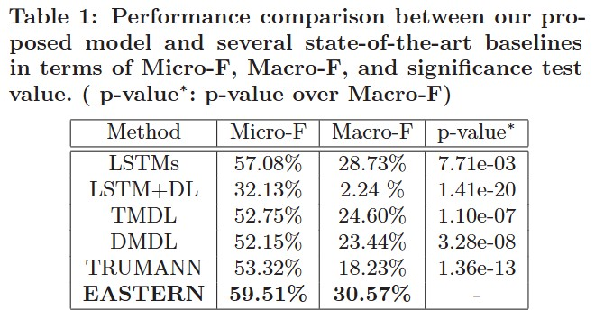

# Official Code for Towards Micro-video Understanding by Joint Sequential-Sparse Modeling


## Introduction
Like the traditional long videos, micro-videos are the unity of textual, acoustic, and visual modalities. These modalities sequentially tell a real-life event from distinct angles. Yet, unlike the traditional long videos with rich content, micro-videos are very short, lasting for 6-15 seconds, and they hence usually convey one or a few high-level concepts. In the light of this, we have to characterize and jointly model the sparseness and multiple sequential structures for better micro-video understanding. To accomplish this, in this paper, we present an end-to-end deep learning model, which packs three parallel LSTMs to capture the sequential structures and a convolutional neural network to learn the sparse concept-level representations of micro-videos. We applied our model to the application of micro-video categorization. Besides, we constructed a real-world dataset for sequence modeling and released it to facilitate other researchers. Experimental results demonstrate that our model yields better performance than several state-of-the-art baselines.

## Links

- **Paper**: [ACM MM](https://dl.acm.org/doi/epdf/10.1145/3123266.3123341)
- **Code Download**: [Baidu Netdisk](https://pan.baidu.com/s/10w6YBLxDLWlehzdBzON-QQ)

The code for several baseline methods:
- **Code Download**: [LSTM+DL](https://pan.baidu.com/s/1M69-oZfoVNjs673qePHEbw)
- **Code Download**: [LSTMs](https://pan.baidu.com/s/1DLz-De4tY4SuS0-WanovWg)
- **Code Download**: [CONV](https://pan.baidu.com/s/1IzMLY2MmxMM5_YmP8T4PeQ)
- **Code Download**: [TMDL](https://pan.baidu.com/s/18ObBwHgCWQhIFNsf3fJ7YQ)
- **Code Download**: [DMDL]([https://pan.baidu.com/s/1eTX8hOI](https://pan.baidu.com/s/1cEwSDXFS6cjp0Z8WVfh1IA))
- **Code Download**: [TRUMANN](https://pan.baidu.com/s/1_8MsVPnIzovtw_uZ0-bV1Q)

## Dataset
Sequence dataset: It is designed for deep learning models based on an LSTM network.
- **Code Download**: [Visual Modality](https://pan.baidu.com/s/1HP9iuc5sWtLwG5uoJg-X7g)
- **Code Download**: [Audio Modality](https://pan.baidu.com/s/1ayahwUpk1GGF-w5IYhQnmQ)
- **Code Download**: [Text Modality](https://pan.baidu.com/s/1tpD8wZFgzOSi5YvI7Phv9Q)

Non-sequence dataset: It is generated by averaging all the sequences of each modality. It contains 4096-D visual feature, 512-D audio feature, and 100-D text feature.
- **Code Download**: [Feature](https://pan.baidu.com/s/1Xuyhv3mwK17AI1q65mNlMw)
- **Code Download**: [Label](https://pan.baidu.com/s/186ZNSOlzNky2IGy-negrFg)

  
## Method Overview

<p align="center">
  
</p>


## Results

<p align="center">
  
</p>

Our method achieves competitive or superior results compared with previous methods on multiple benchmarks.

## License

Copyright (C) 2018 Shandong University

This program is licensed under the GNU General Public License v3.0.  
You may obtain a copy of the license at:  
https://www.gnu.org/licenses/gpl-3.0.html

Any derivative work based on this program must also be licensed under the GNU General Public License as published by the Free Software Foundation, either version 3 of the License, or (at your option) any later version, if such derivative work is distributed to a third party.

The copyright of this program is owned by Shandong University.

For commercial projects that require distributing this code as part of a program that cannot be released under the GNU General Public License, please contact `mengliu.sdu@gmail.com` to obtain a commercial license.

## Citation

If you find this project useful in your research, please consider citing:

```bibtex
@inproceedings{10.1145/3123266.3123341,
author = {Liu, Meng and Nie, Liqiang and Wang, Meng and Chen, Baoquan},
title = {Towards Micro-video Understanding by Joint Sequential-Sparse Modeling},
year = {2017},
booktitle = {Proceedings of the 25th ACM International Conference on Multimedia},
pages = {970–978}
}
